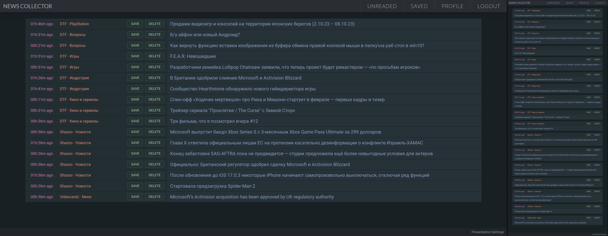

News Collector
==========================
Персональный проект которым я пользуюсь для чтения новостей.

Состоит из трех частей:
- Spider - Парсер, который собирает новости с интересных мне сайтов и заносит их в БД.
- Client - Фронтенд на для просмотра всех новостей в единой таблице.
- Server - Бэкенд для взаимодействия с БД через запросы по REST API.

Использованные технологии: TailwindCSS, React + RTK/Q, Express, MongoDB.\
Выложено на GitHub для портфолио.

#

