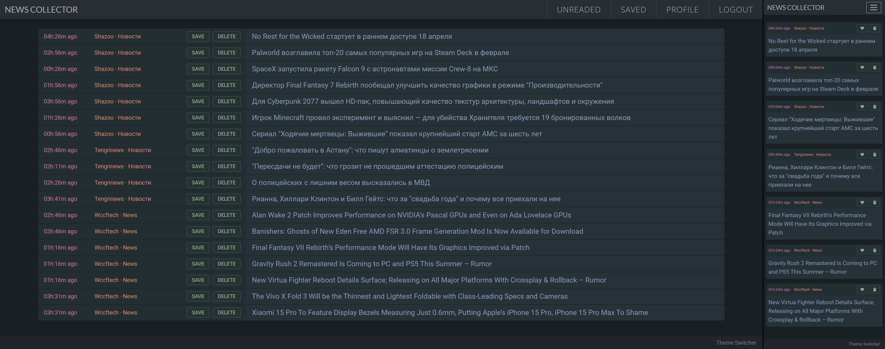

News Collector
==========================
Персональный проект которым я пользуюсь для чтения новостей.

Состоит из трех частей:
- Spider - бот, который собирает новости с интересных мне сайтов и заносит их в БД.
- Client - фронтенд на Реакте для просмотра всех новостей в единой таблице.
- Server - rest-api для взаимодействия с БД.

Использованные технологии: React, Express, MongoDB.\
Выложено на GitHub для портфолио.

#

